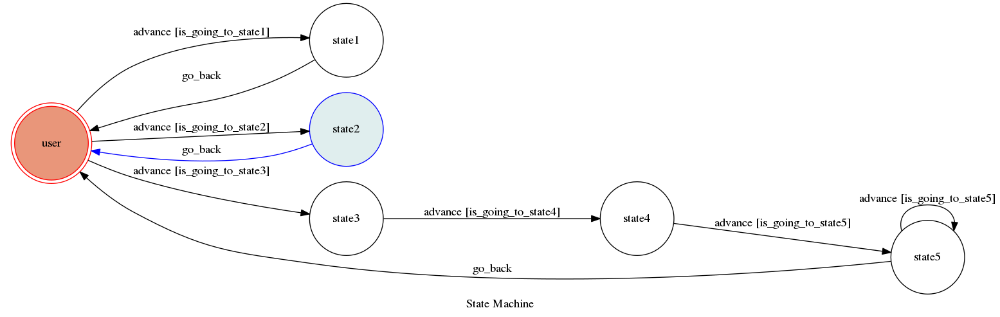

# TOC Project 2017

Template Code for TOC Project 2017

A telegram bot based on a finite state machine

## Setup

### Prerequisite
* Python 3

#### Install Dependency
```sh
pip install -r requirements.txt
```

* pygraphviz (For visualizing Finite State Machine)
    * [Setup pygraphviz on Ubuntu](http://www.jianshu.com/p/a3da7ecc5303)

### Secret Data

`API_TOKEN` and `WEBHOOK_URL` in app.py **MUST** be set to proper values.
Otherwise, you might not be able to run your code.

### Run Locally
You can either setup https server or using `ngrok` as a proxy.

**`ngrok` would be used in the following instruction**

```sh
ngrok http 5000
```

After that, `ngrok` would generate a https URL.

You should set `WEBHOOK_URL` (in app.py) to `your-https-URL/hook`.

#### Run the sever

```sh
python3 app.py
```

## Finite State Machine


## Usage
The initial state is set to `user`.


user能到三個state，有一條又接兩個state，

一個輸入『心好累』，會回『弟怎了，私』後回user

一個輸入『我也喜歡玖壹壹』，會回『品味不錯兄弟\n這首-> https://www.youtube.com/watch?v=JvkqZrYJUe8』

一個輸入『看三小』，會回『你現在是在挑釁』進下個state，再輸入『是又怎樣』，會回『幹出來挑』進下個trap state，再輸入任何東西，會回『諒你不敢啦孬種』，但輸入『我工程師，體諒下』，會不回話，且回到user state


